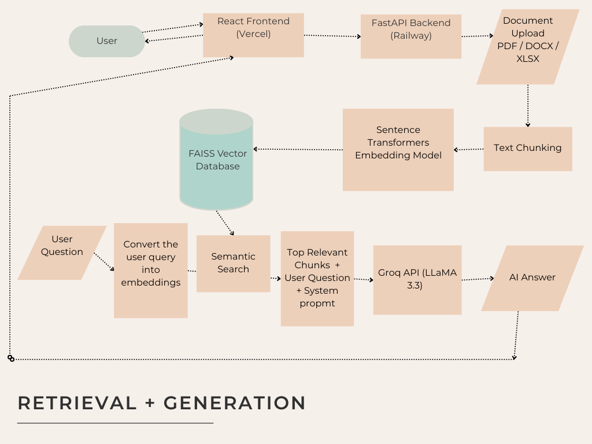

# 📦 Supply Chain RAG Explorer (React Frontend)

-----
Add a "reference files" feature to the hook submission flow, mirroring the
one that already exists for skill submissions.

Context: When submitting a skill for review, users can attach reference
files (extra docs referenced by the skill, e.g. stored under
`skills/<skill-name>/references/`) that reviewers can see alongside the
main submission. Hooks don't have this capability yet — add it.

Please:
1. Find how the skill submission's reference-files feature is built end
   to end: the form field/UI component for attaching files, the backend
   model/schema that stores the file references and how they're
   associated with a skill, the storage path convention, any file-type
   or size validation, and how reference files are displayed in the
   review UI.
2. Find the current hook submission form/flow (form component, backend
   model, storage handling) so you know what you're extending and
   whether the two flows already share any submission logic.
3. Add the same capability to hook submissions:
   - Reuse the skill's upload component/service rather than duplicating
     it, if the codebase structure makes that possible.
   - Use an equivalent storage convention for hooks (e.g.
     `hooks/<hook-name>/references/`) and the same data-model pattern
     (association + validation) that skills use.
   - Surface reference files in the hook review UI the same way they
     appear for skill review.
4. Match the skill feature's validation rules (file types, size limits,
   required vs. optional) unless something about hooks needs different
   rules — flag that instead of guessing.
5. Add tests mirroring whatever tests cover the skill reference-files
   feature, adapted for hooks.

Show me the diff, and call out anywhere you had to diverge from the
skill implementation because of how hooks are structured differently.
----


This repository contains the **React + TypeScript + Vite frontend** for a **Retrieval-Augmented Generation (RAG) system**.  
It allows you to:

- Upload documents (PDF, Word, Excel)
- Ask natural-language questions
- Get AI-generated answers based only on your uploaded data

This repo is meant for **learning, exploring, and experimenting with RAG**, not just as a template UI.

---

## 🧠 RAG System Architecture

Below is the high-level architecture of the full system (Frontend + Backend + AI Pipeline):



---

## 🧱 Tech Stack

* ⚛️ React 19
* 🟦 TypeScript
* ⚡ Vite
* 🎨 Custom dark/green UI
* 🌐 REST API integration (`upload` + `ask`)
* 🧠 RAG Pipeline (via FastAPI backend)
* 🔍 FAISS Vector Database
* 🤖 Groq LLaMA 3.3

---

## 📂 What This Repo Includes

* Upload UI for documents
* Question input & answer panel
* Status messages & error handling
* API connection layer (`src/api.ts`)
* Ready for deployment on **Vercel**

❗ This repo does **not** include the backend.
You must run the FastAPI RAG backend separately.

---

## 🔑 Environment Setup

Create a `.env` file in the project root:

```env
VITE_API_BASE_URL=http://localhost:8000
```

If using a deployed backend (Railway, etc.):

```env
VITE_API_BASE_URL=https://your-backend-url.up.railway.app
```

---

## ▶️ Run Locally

```bash
# 1. Clone the repo
git clone https://github.com/your-username/your-repo-name.git

# 2. Move into the project
cd your-repo-name

# 3. Install dependencies
npm install

# 4. Start the app
npm run dev
```

Then open:

```
http://localhost:5173
```

Make sure your **FastAPI backend is running at the API URL**.

---

## 🔄 How the RAG Flow Works

1. User uploads a file
2. Frontend sends it to the FastAPI backend
3. Backend:

   * Chunks the file
   * Creates embeddings
   * Stores them in FAISS
4. User asks a question
5. Backend:

   * Finds the most relevant chunks
   * Sends them to Groq LLaMA
6. AI-generated answer is returned to the UI

---

## 🚀 Deployment

This frontend is optimized for:

* ✅ **Vercel**
* ✅ **Netlify**
* ✅ Any static Vite-compatible host

Build command:

```bash
npm run build
```

Output folder:

```bash
dist
```

---

## 🎯 Who This Is For

* Developers learning **RAG architecture**
* Students exploring **LLMs + vector databases**
* Frontend engineers integrating **real AI systems**
* Anyone building **AI-powered document Q&A**

---
