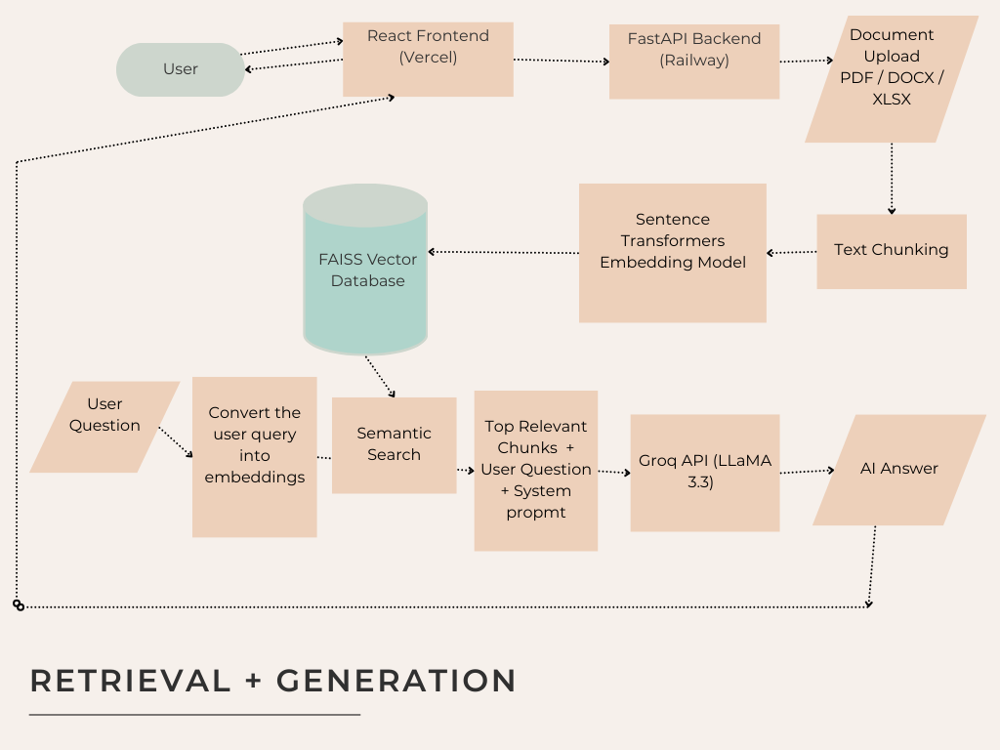

# 📦 Supply Chain RAG Explorer (React Frontend)

---
Start
----
```
---
id: uninspectable-files
severity: medium
action: deny
applies_to: [file]
detector:
  type: attachment
  media_type_prefixes: ["image/", "application/vnd.openxmlformats", "application/vnd.ms-", "application/msword"]
---

# Images and Office files the hook could not read

Images, and Office documents that yield no text (almost always encrypted or
password-protected), cannot be checked by the classification and PII rules,
so they may not be sent to Claude. Screenshots of documents are a realistic
path for higher-classified material, and an encrypted file is by definition
something the hook cannot inspect.

The detector only matches files with no extracted text, so readable Office
documents are handled by the classification and PII rules as usual. Other
unreadable files (scanned PDFs, archives, unknown binaries) are only logged,
under `uninspectable-other`, while the false-positive rate is measured.

## Message to user

{file} could not be inspected (no readable text), and files that cannot be
checked may not be sent to Claude. Convert it to a text-based format or use an
approved copy. Reference: {reference_id}
```
---
End
----

## 🧠 RAG System Architecture

Below is the high-level architecture of the full system (Frontend + Backend + AI Pipeline):



---

## 🧱 Tech Stack

* ⚛️ React 19
* 🟦 TypeScript
* ⚡ Vite
* 🎨 Custom dark/green UI
* 🌐 REST API integration (`upload` + `ask`)
* 🧠 RAG Pipeline (via FastAPI backend)
* 🔍 FAISS Vector Database
* 🤖 Groq LLaMA 3.3

---

## 📂 What This Repo Includes

* Upload UI for documents
* Question input & answer panel
* Status messages & error handling
* API connection layer (`src/api.ts`)
* Ready for deployment on **Vercel**

❗ This repo does **not** include the backend.
You must run the FastAPI RAG backend separately.

---

## 🔑 Environment Setup

Create a `.env` file in the project root:

```env
VITE_API_BASE_URL=http://localhost:8000
```

If using a deployed backend (Railway, etc.):

```env
VITE_API_BASE_URL=https://your-backend-url.up.railway.app
```

---

## ▶️ Run Locally

```bash
# 1. Clone the repo
git clone https://github.com/your-username/your-repo-name.git

# 2. Move into the project
cd your-repo-name

# 3. Install dependencies
npm install

# 4. Start the app
npm run dev
```

Then open:

```
http://localhost:5173
```

Make sure your **FastAPI backend is running at the API URL**.

---

## 🔄 How the RAG Flow Works

1. User uploads a file
2. Frontend sends it to the FastAPI backend
3. Backend:

   * Chunks the file
   * Creates embeddings
   * Stores them in FAISS
4. User asks a question
5. Backend:

   * Finds the most relevant chunks
   * Sends them to Groq LLaMA
6. AI-generated answer is returned to the UI

---

## 🚀 Deployment

This frontend is optimized for:

* ✅ **Vercel**
* ✅ **Netlify**
* ✅ Any static Vite-compatible host

Build command:

```bash
npm run build
```

Output folder:

```bash
dist
```

---

## 🎯 Who This Is For

* Developers learning **RAG architecture**
* Students exploring **LLMs + vector databases**
* Frontend engineers integrating **real AI systems**
* Anyone building **AI-powered document Q&A**

---
